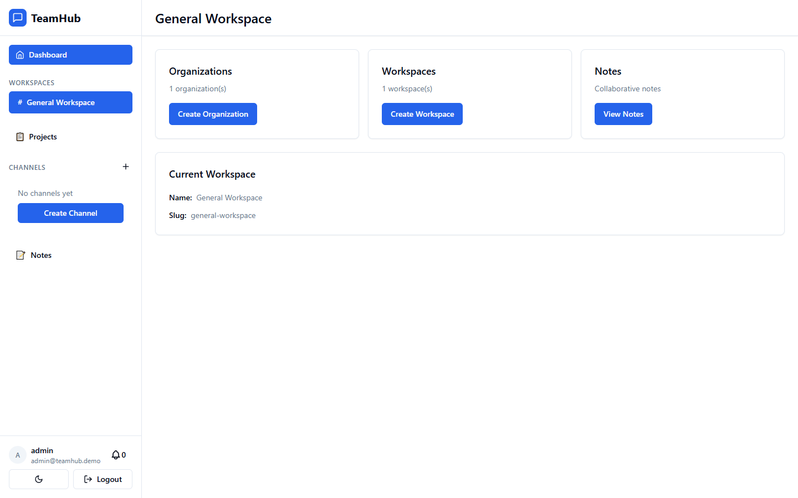
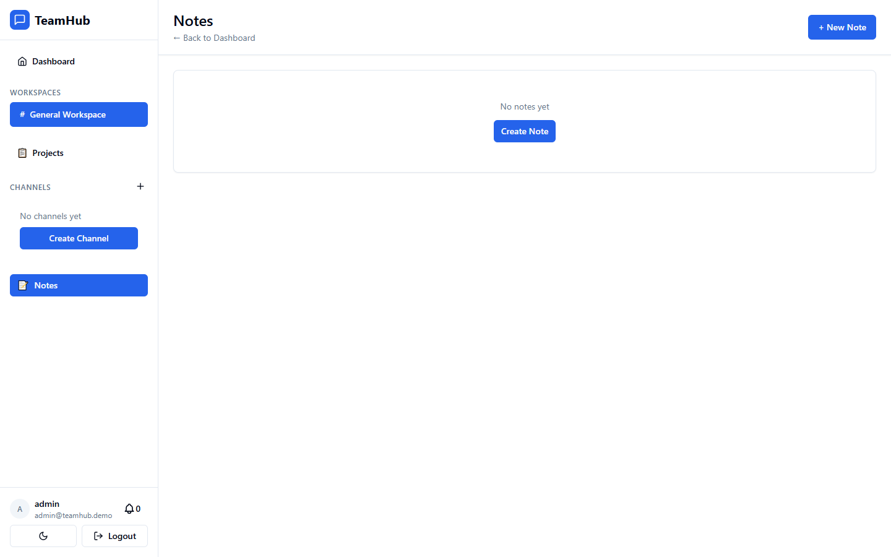
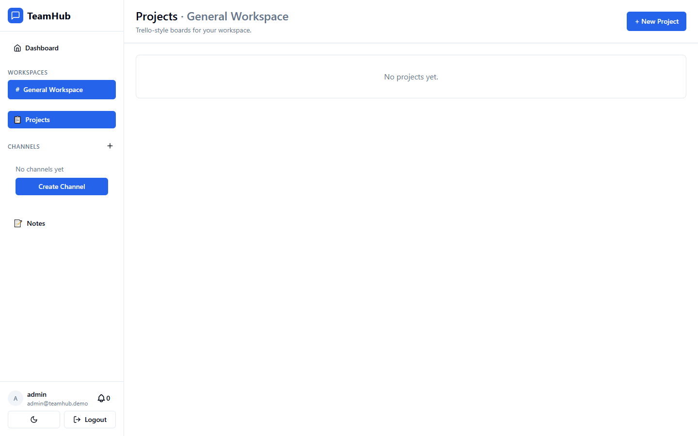

# TeamHub — Portfolio One-Pager

### 🔗 Live Demo
- Web App: **Coming soon**
- API Docs (Swagger): **Coming soon**
- Repo: (this repo)

### ▶️ Run locally
See [QUICK_START.md](./QUICK_START.md).

### 🔑 Demo Credentials
> After running `npm run seed`

**Admin**
- Email: `admin@teamhub.demo`
- Password: `Admin123!`

**Member**
- Email: `member@teamhub.demo`
- Password: `Member123!`

### 🧩 What I Built (max 5 bullets)
- Built a production-ready collaboration platform (Slack + Notion-lite) with real-time messaging and collaborative notes.
- Implemented multi-tenant workspaces with RBAC (Owner/Admin/Member/Guest) and secure JWT auth + refresh tokens.
- Designed a scalable real-time system using Socket.io + Redis adapter (presence, typing, live updates).
- Built file upload + preview system with S3-compatible storage and local fallback for development.
- Added search, notifications, and audit logs with background jobs using BullMQ.

### ⭐ Key Features (max 6 bullets)
- Real-time chat: channels, DMs, threads, reactions, mentions, typing indicators, presence
- Multi-tenant workspaces + RBAC permissions
- Notion-lite collaborative notes with version history + comments
- File sharing with previews (S3 + local dev fallback)
- Global search (Ctrl/Cmd+K) with filters (channel/user/date/file/link)
- Notifications (in-app + email preferences) + audit logs

### 🧱 Tech Stack
- Frontend: React 18, Vite, Tailwind CSS, shadcn/ui, React Router, TanStack Query, Zustand, Zod, Socket.io Client
- Backend: NestJS, MongoDB (Mongoose), Redis, BullMQ, JWT (refresh tokens), Swagger/OpenAPI
- Infra: Docker, docker-compose, GitHub Actions

### 🏗️ Architecture (high level)
```txt
React (Vite)  ⇄  NestJS API (REST)
   │                 │
   │ Socket.io       │ MongoDB
   ▼                 ▼
Socket.io Gateway  Database
   │
   ▼
Redis (presence, adapter, scaling)
   │
   ▼
S3 / Local Storage (files)
BullMQ (emails, notifications, jobs)
```

### 🖼️ Screenshots






