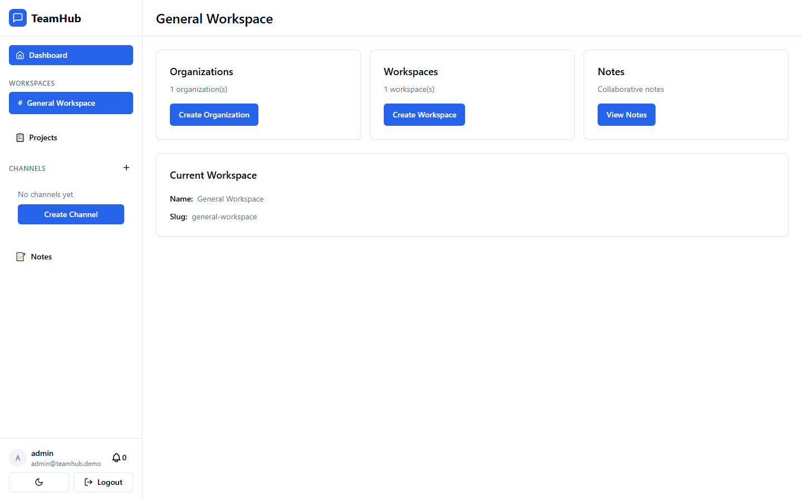
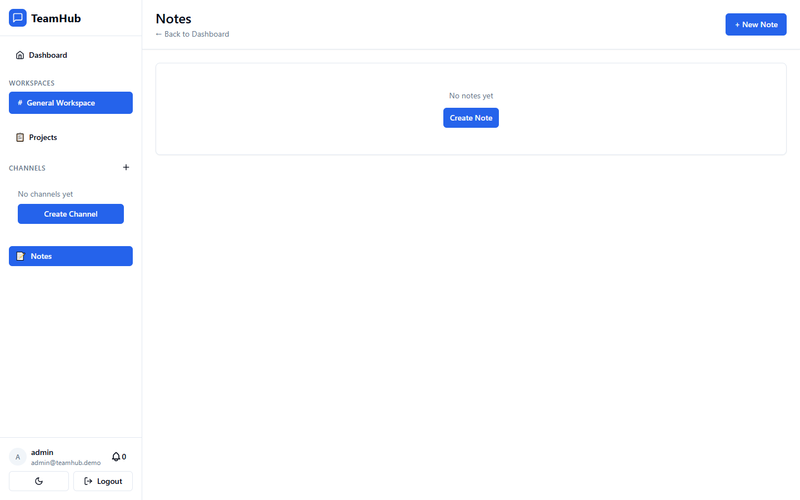
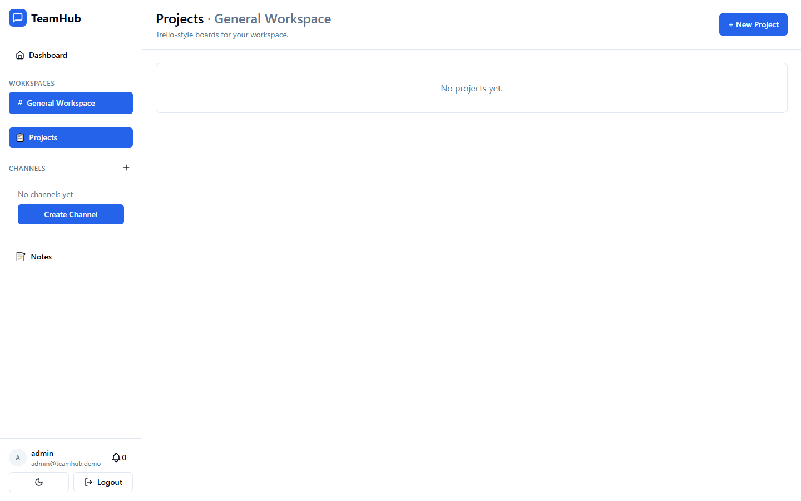

# TeamHub — Real-Time Team Collaboration Platform

> A production-ready, full-stack collaboration platform built with the MERN stack and NestJS — featuring real-time messaging, multi-tenant workspaces, collaborative notes, and role-based access control.

[](https://nodejs.org)
[](https://www.typescriptlang.org)
[](https://mongoosejs.com)
[](https://nestjs.com)
[](https://reactjs.org)

---

## 🔗 Live Demo

| Resource | Link |
|---|---|
| Web App | **Coming soon** |
| API Docs (Swagger) | **Coming soon** |
| Repository | [github.com/shifaosman/TeamHub](https://github.com/shifaosman/TeamHub) |

---

## 📖 Description

**TeamHub** is a full-stack, production-grade team collaboration platform inspired by Slack and Notion. It provides real-time messaging, shared workspaces, collaborative note-taking, project tracking, and file management — all within a secure, multi-tenant architecture.

The platform is built to demonstrate proficiency across the entire stack: a React + TypeScript frontend, a NestJS REST API with WebSocket support, a MongoDB database, and Redis-backed background job processing. It reflects real-world engineering decisions around scalability, security, and developer experience.

---

## ✨ Key Features

- **Real-time messaging** — channels, direct messages, threads, reactions, mentions, typing indicators, and online presence powered by Socket.io
- **Multi-tenant workspaces** — isolated workspaces with role-based access control (Owner / Admin / Member / Guest)
- **Collaborative notes** — a Notion-inspired notes editor with version history and inline comments
- **Project & task tracking** — kanban-style boards with drag-and-drop task management
- **File sharing** — upload, preview, and manage files via AWS S3 or local storage fallback
- **Global search** — command-palette search (`Ctrl/Cmd + K`) with filters by channel, user, date, file, and link
- **Notifications** — in-app and email notifications with per-user preference settings
- **Audit logs** — activity history across workspaces for compliance and transparency
- **Secure authentication** — JWT access tokens + refresh token rotation, bcrypt password hashing, and rate limiting

---

## 🧱 Tech Stack

### Frontend
| Technology | Purpose |
|---|---|
| React 18 | UI framework |
| TypeScript | Static typing |
| Vite | Build tool & dev server |
| Tailwind CSS + shadcn/ui | Styling and component library |
| React Router v6 | Client-side routing |
| TanStack Query (React Query) | Server state management & caching |
| Zustand | Global client state management |
| Zod | Schema validation |
| Socket.io Client | Real-time WebSocket communication |

### Backend
| Technology | Purpose |
|---|---|
| NestJS 10 | Server framework (modular, scalable) |
| Node.js 18+ | Runtime |
| TypeScript | Static typing |
| MongoDB + Mongoose | Primary database and ODM |
| Redis + ioredis | Caching, pub/sub, Socket.io adapter |
| BullMQ | Background job queues (emails, notifications) |
| JWT (access + refresh tokens) | Authentication |
| Passport.js | Auth middleware |
| Swagger / OpenAPI | API documentation |
| AWS S3 SDK | File storage |
| Nodemailer | Email delivery |
| Helmet + Rate Limiting | Security hardening |

### Infrastructure & DevOps
| Technology | Purpose |
|---|---|
| Docker + docker-compose | Containerized local and production environments |
| GitHub Actions | CI/CD pipeline |
| npm Workspaces | Monorepo management |

---

## 🏗️ Architecture Overview

TeamHub follows a monorepo layout with a clear separation between frontend and backend concerns.

```
┌──────────────────────────────────────────────────────────┐
│                     Browser (React 18)                   │
│  Vite · TanStack Query · Zustand · Socket.io Client      │
└────────────────────────┬─────────────────────────────────┘
                         │  HTTP (REST)  /  WebSocket
                         ▼
┌──────────────────────────────────────────────────────────┐
│                  NestJS API  (Port 2000)                  │
│  REST Controllers → Services → Mongoose Models           │
│  Socket.io Gateway ─── Redis Adapter (scaling)           │
│  BullMQ Workers (email, notifications)                   │
└────────┬────────────────────────────┬────────────────────┘
         │                            │
         ▼                            ▼
┌─────────────────┐        ┌─────────────────────┐
│    MongoDB      │        │       Redis          │
│  (Primary DB)   │        │  (Cache · Pub/Sub ·  │
│                 │        │   Queue · Presence)  │
└─────────────────┘        └─────────────────────┘
         │
         ▼
┌─────────────────────────────┐
│   AWS S3 / Local Storage    │
│   (File uploads & previews) │
└─────────────────────────────┘
```

**Request flow:**
1. The **React** client makes REST calls or opens a WebSocket connection to the **NestJS API**.
2. The API authenticates requests via **JWT**, enforces **RBAC** permissions, and delegates to domain services.
3. Domain services read and write data to **MongoDB** via Mongoose.
4. **Real-time events** (messages, presence, typing) flow through the Socket.io Gateway, scaled horizontally via a **Redis** adapter.
5. Background tasks (email delivery, notification fan-out) are offloaded to **BullMQ** workers backed by Redis.
6. Uploaded files are stored in **AWS S3** (production) or local disk (development).

---

## 🖼️ Screenshots

**Dashboard**



**Collaborative Notes**



**Project Board**



---

## 🚀 Installation

### Prerequisites

- Node.js ≥ 18
- npm ≥ 9
- Docker & docker-compose

### 1. Clone the repository

```bash
git clone https://github.com/shifaosman/TeamHub.git
cd TeamHub
```

### 2. Install dependencies

```bash
npm install
```

### 3. Configure environment variables

```bash
# Backend
cp apps/api/.env.example apps/api/.env

# Frontend
cp apps/web/.env.example apps/web/.env   # if applicable
```

Update `apps/api/.env` with your local values (see [Environment Variables](#-environment-variables) below).

### 4. Start infrastructure services

```bash
# Start MongoDB and Redis via Docker
docker-compose up -d mongo redis
```

### 5. Seed demo data

```bash
npm run seed
```

### 6. Start the development servers

```bash
npm run dev
```

| Service | URL |
|---|---|
| Frontend | http://localhost:5173 |
| Backend API | http://localhost:2000 |
| Swagger Docs | http://localhost:2000/docs |

### Demo credentials

| Role | Email | Password |
|---|---|---|
| Admin | `admin@teamhub.demo` | `Admin123!` |
| Member | `member@teamhub.demo` | `Member123!` |

---

## 🔑 Environment Variables

### Backend — `apps/api/.env`

| Variable | Description | Example |
|---|---|---|
| `NODE_ENV` | Runtime environment | `development` |
| `PORT` | API server port | `2000` |
| `MONGODB_URI` | MongoDB connection string | `mongodb://localhost:27017/teamhub` |
| `REDIS_HOST` | Redis hostname | `localhost` |
| `REDIS_PORT` | Redis port | `6379` |
| `JWT_SECRET` | Secret for access token signing | *(generate with `openssl rand -base64 32`)* |
| `JWT_REFRESH_SECRET` | Secret for refresh token signing | *(generate with `openssl rand -base64 32`)* |
| `JWT_EXPIRES_IN` | Access token lifetime | `15m` |
| `JWT_REFRESH_EXPIRES_IN` | Refresh token lifetime | `7d` |
| `USE_LOCAL_STORAGE` | Use local disk instead of S3 | `true` |
| `AWS_REGION` | AWS region for S3 | `us-east-1` |
| `AWS_ACCESS_KEY_ID` | AWS access key | *(from IAM)* |
| `AWS_SECRET_ACCESS_KEY` | AWS secret key | *(from IAM)* |
| `AWS_S3_BUCKET` | S3 bucket name | `teamhub-files` |
| `APP_URL` | Frontend origin (for CORS) | `http://localhost:5173` |
| `SMTP_HOST` | SMTP server hostname | `smtp.gmail.com` |
| `SMTP_PORT` | SMTP port | `587` |
| `SMTP_USER` | SMTP username / email | `you@example.com` |
| `SMTP_PASS` | SMTP password or app password | *(from email provider)* |
| `EMAIL_FROM` | Sender address | `noreply@teamhub.com` |

### Frontend — `apps/web/.env`

| Variable | Description | Example |
|---|---|---|
| `VITE_API_URL` | Backend REST base URL | `http://localhost:2000/api` |
| `VITE_WS_URL` | WebSocket server URL | `ws://localhost:2000` |

---

## 📁 Project Structure

```
TeamHub/
├── apps/
│   ├── api/                   # NestJS backend
│   │   └── src/
│   │       ├── auth/          # JWT authentication & Passport strategies
│   │       ├── users/         # User management
│   │       ├── workspaces/    # Multi-tenant workspace logic
│   │       ├── channels/      # Messaging channels
│   │       ├── messages/      # Message CRUD & threading
│   │       ├── notes/         # Collaborative notes
│   │       ├── projects/      # Project & task tracking
│   │       ├── tasks/         # Task management
│   │       ├── files/         # File upload & S3 integration
│   │       ├── search/        # Global full-text search
│   │       ├── notifications/ # In-app & email notifications
│   │       ├── activity/      # Audit log & activity feed
│   │       ├── gateway/       # Socket.io WebSocket gateway
│   │       ├── redis/         # Redis module & adapter
│   │       └── common/        # Shared guards, decorators, pipes
│   └── web/                   # React + Vite frontend
│       └── src/
│           ├── components/    # Reusable UI components (shadcn/ui)
│           ├── pages/         # Route-level page components
│           ├── hooks/         # Custom React hooks
│           ├── stores/        # Zustand state stores
│           ├── contexts/      # React context providers
│           └── lib/           # Utilities and API client
├── packages/
│   └── shared/                # Shared TypeScript types and schemas (Zod)
├── docs/
│   └── screenshots/           # Application screenshots
├── docker-compose.yml         # Local development services
├── docker-compose.prod.yml    # Production Docker configuration
└── package.json               # Monorepo root (npm workspaces)
```

---

## 💡 What I Learned

This project was an opportunity to apply and deepen skills across the full stack in a realistic, production-like context:

- **NestJS architecture** — Designed a modular, dependency-injected backend with clear separation of controllers, services, and repositories
- **Real-time systems** — Implemented a scalable Socket.io gateway with a Redis adapter to support horizontal scaling and cross-instance event broadcasting
- **Authentication & security** — Built a complete JWT + refresh token rotation flow with Passport.js, bcrypt, and rate limiting
- **Background processing** — Offloaded email delivery and notification fan-out to BullMQ workers, keeping API responses fast
- **MongoDB data modelling** — Designed multi-tenant schemas with Mongoose, including RBAC embedded in workspace membership documents
- **State management at scale** — Combined TanStack Query for server state with Zustand for UI state, minimising unnecessary re-renders
- **Monorepo tooling** — Managed a multi-package monorepo with npm workspaces and shared TypeScript types across frontend and backend
- **DevOps fundamentals** — Containerised all services with Docker Compose and configured a GitHub Actions CI pipeline

---

## 🔭 Future Improvements

- **Video & voice calls** — Integrate WebRTC for in-channel video conferencing
- **Rich text editor** — Replace plain-text notes with a ProseMirror / TipTap WYSIWYG editor with real-time collaborative cursors (CRDT)
- **End-to-end encryption** — Add client-side encryption for DMs to improve privacy
- **Mobile application** — Build a React Native companion app sharing the same `@teamhub/shared` type package
- **Observability** — Add structured logging with Winston/Pino, distributed tracing with OpenTelemetry, and a Grafana dashboard
- **Kubernetes deployment** — Migrate from docker-compose to a Helm chart for production-grade orchestration
- **Plugin / integration system** — Expose a public webhook API so teams can connect third-party tools (GitHub, Jira, etc.)

---

## 👤 Author

**Shifao Osman**
*MERN Stack / Full-Stack Engineer*

[](https://github.com/shifaosman)

---

*Built with ❤️ to demonstrate full-stack engineering capabilities across the entire modern web development lifecycle.*

