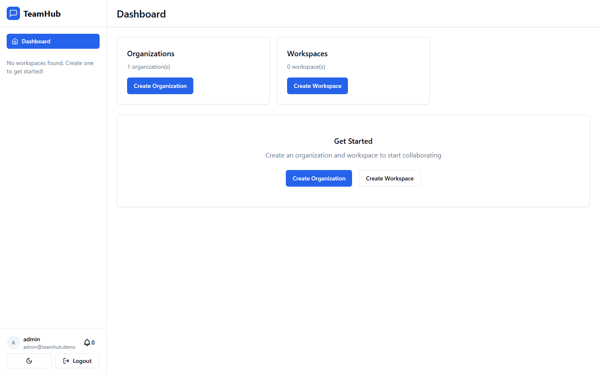

# TeamHub

**Real-time team collaboration platform** — A modern SaaS-style app (inspired by Linear, Slack, Notion) with multi-tenant workspaces, real-time messaging, collaborative notes, and Kanban project boards. Built with React, NestJS, MongoDB, Redis, and Socket.io. Features a clean UI (Tailwind + shadcn/ui), global command palette (`Ctrl/Cmd + K`), loading skeletons, empty states, and production-ready architecture.

| Link | URL |
|------|-----|
| Repository | [github.com/shifaosman/TeamHub](https://github.com/shifaosman/TeamHub) |
| Live demo / API docs | *Add when deployed* |

---

## Portfolio Summary

*Use this paragraph on your GitHub profile, portfolio site, or job applications:*

> **TeamHub** is a production-ready collaboration platform that solves distributed team communication and project coordination. I designed and built the full stack: a modular NestJS API with JWT auth, refresh-token rotation, and a Socket.io gateway (Redis adapter) for real-time messaging and presence; a React 18 + TypeScript frontend with TanStack Query, Zustand, and a global command palette; and a shared monorepo package for type-safe contracts. Key technical highlights include multi-tenant RBAC, BullMQ background jobs for email and notifications, MongoDB + Mongoose data modeling, AWS S3 (with local fallback) for file storage, Swagger/OpenAPI docs, Docker Compose for local dev, and GitHub Actions CI (lint, unit, e2e, build). The project showcases end-to-end ownership, security-conscious design, and scalable real-time systems—suitable for portfolio and technical discussions in interviews.

---

## Screenshots

| Dashboard | Notes | Projects | Activity |
|-----------|-------|----------|-----------|
|  |  |  | *Activity timeline: `docs/screenshots/05-activity.png`* |

*Add more screenshots to `docs/screenshots/` as needed (e.g. Activity timeline).*

---

## Key Features

- **Modern UI** — Clean layout, consistent typography, soft shadows, rounded corners, light/dark mode, loading skeletons, and empty states (Linear/Slack/Notion-inspired).
- **Real-time messaging** — Channels with **@mentions** (autocomplete when typing `@`), **emoji reactions** (add/remove, real-time via Socket.io), **threaded replies** (side panel), typing indicators, and online presence.
- **Multi-tenant workspaces** — Isolated workspaces with RBAC (Owner / Admin / Member / Guest).
- **Collaborative notes** — Notion-style notes with version history and inline comments.
- **Project & task tracking** — Kanban boards with drag-and-drop (@dnd-kit), **task priority** (low/medium/high/urgent), **labels/tags**, due dates, assignees, and a task detail drawer (description, comments, due date, watchers).
- **File sharing** — Upload, preview, and manage files (AWS S3 or local storage).
- **File Collaboration System** — Workspace file hub at `/workspaces/:workspaceId/files`: upload (button + drag-and-drop), search and filter by type/name, grid and list views, file detail drawer with preview (images/video/document placeholder), metadata (size, type, uploader, date), comments thread, and download/delete. Helps teams centralize and manage assets in one place (Dropbox/Notion/Slack-style).
- **Smart command palette** — `Ctrl/Cmd + K` opens a Raycast/Linear-style command palette: **search** across channels, projects, notes, tasks, messages, and files; **quick actions** (e.g. `task Fix bug`, `note Sprint plan`, `analytics`, `activity`); **pages** (Dashboard, Activity, Analytics, Notes, Projects); **recent actions**; keyboard-first (↑↓ navigate, Enter select, Esc close). Prefix-based command parsing for create-note, create-task, go-to-page, and open-entity. Improves navigation and productivity without leaving the keyboard.
- **Dashboard** — Workspace home with recent activity, active projects, channels, and task CTA.
- **Notifications** — In-app and email with per-user preferences; BullMQ for async delivery.
- **Workspace Activity Timeline** — Central feed of workspace events: who created or moved tasks, posted messages, uploaded files, edited notes, created channels, or joined the workspace. Filter by type (tasks, projects, notes, messages, files, channels), grouped by day (Today, Yesterday, Earlier this week), with load-more and clean timeline UI for team visibility and auditability.
- **Workspace Analytics Dashboard** — Metrics page at `/workspaces/:workspaceId/analytics` to measure progress and collaboration: KPI cards (tasks, completed, projects, members), tasks created vs completed over time, messages over time, task status and priority distribution, project completion progress bars, most active channels and members, and collaboration snapshot (notes edited, files uploaded, messages). Date range filter (7d / 30d / 90d). Helps teams answer: Are we completing work? Which projects are moving? Who is contributing most?
- **Audit & activity** — Activity model and API back the timeline and analytics; events are recorded automatically from projects, tasks, notes, messages, channels, files, and workspace membership.
- **Authentication & security** — JWT access + refresh token rotation, bcrypt, rate limiting, Helmet. API validates required env in production.
- **Automated testing** — **Frontend:** Vitest + React Testing Library; tests for login page (form render, links, submit, error display) and command palette (closed state, open with search input and page results). Run with `npm run test:web`. **Backend:** Jest unit tests (e.g. `AuthService`) and e2e/integration tests for auth (register, login, token validation), notes (create, list, update), analytics (workspace analytics endpoint), and files (upload, list). Run unit tests with `npm run test:api`; e2e with `npm run test:e2e` from `apps/api` (requires MongoDB and optionally Redis).

---

## Tech Stack

| Layer | Technologies |
|-------|--------------|
| **Frontend** | React 18, TypeScript, Vite, Tailwind CSS, shadcn/ui, Radix UI, Recharts, Framer Motion (optional), React Router v6, TanStack Query, Zustand, Zod, Socket.io Client. Lazy-loaded routes, command palette (⌘K). |
| **Backend** | NestJS 10, Node.js 18+, TypeScript, MongoDB (Mongoose), Redis (ioredis), BullMQ, JWT, Passport.js, Swagger, AWS S3, Nodemailer |
| **Infrastructure** | Docker & Docker Compose, GitHub Actions (CI) |
| **Monorepo** | npm workspaces, `@teamhub/shared` (Zod schemas & types) |

---

## Architecture Overview

```
┌──────────────────────────────────────────────────────────┐
│                  Browser (React 18 + Vite)                │
│     TanStack Query · Zustand · Socket.io Client           │
└────────────────────────┬─────────────────────────────────┘
                         │  REST  /  WebSocket
                         ▼
┌──────────────────────────────────────────────────────────┐
│                  NestJS API (e.g. port 2000)              │
│     REST → Services → Mongoose · Socket.io Gateway        │
│     BullMQ workers (email, notifications)                 │
└────────┬────────────────────────────┬─────────────────────┘
         │                            │
         ▼                            ▼
┌─────────────────┐        ┌─────────────────────┐
│    MongoDB      │        │       Redis          │
│  (Primary DB)   │        │  Cache · Pub/Sub ·   │
│                 │        │  Queue · Presence    │
└─────────────────┘        └─────────────────────┘
         │
         ▼
┌─────────────────────────────┐
│   AWS S3 / Local Storage     │
└─────────────────────────────┘
```

- **Request flow:** React → NestJS (JWT + RBAC) → services → MongoDB; real-time via Socket.io gateway; background work via BullMQ + Redis.
- **Activity timeline:** Events (project/task/note/message/file/channel/workspace) are recorded by the Activity service and stored in MongoDB. The feed API supports workspace-scoped listing with optional `entityType` filter and pagination; the frontend shows a grouped timeline with actor info and links to the related entity.
- **Analytics:** The analytics module exposes `GET /workspaces/:workspaceId/analytics?period=7d|30d|90d`. It uses MongoDB aggregations to compute overview counts, task time-series (created/completed), task status and priority breakdowns, project progress, most active channels (by message count), most active users (by activity count), and collaboration time-series (messages, notes edited, files uploaded). All queries are workspace-scoped and access-checked.
- **File collaboration:** The files module supports workspace-scoped upload (with optional `folderId`), list/search with filters (`search`, `mimeType`: image/video/document, `sort`, `order`), file details with uploader and preview URL, and file comments (add/list). Metadata includes `workspaceId`, `uploadedBy`, `originalName`, `mimeType`, `size`, `createdAt`/`updatedAt`. Storage remains AWS S3 or local; MongoDB holds file and file-comment metadata. Sidebar and command palette link to the File Hub.

---

## Installation & Run Locally

### Prerequisites

- Node.js ≥ 18, npm ≥ 9
- Docker & Docker Compose (for MongoDB and Redis)

### Steps

1. **Clone and install**

   ```bash
   git clone https://github.com/shifaosman/TeamHub.git
   cd TeamHub
   npm install
   ```

2. **Environment**

   ```bash
   cp apps/api/.env.example apps/api/.env
   ```

   Edit `apps/api/.env` (e.g. `JWT_SECRET`, `JWT_REFRESH_SECRET` via `openssl rand -base64 32`). For frontend, set `VITE_API_URL` and `VITE_WS_URL` in `apps/web/.env` if you use one.

3. **Start MongoDB and Redis**

   ```bash
   docker-compose up -d mongo redis
   ```

4. **Seed data (optional)**

   ```bash
   npm run seed
   ```

5. **Run dev servers**

   ```bash
   npm run dev
   ```

| Service      | URL                    |
|-------------|------------------------|
| Frontend    | http://localhost:5173  |
| Backend API | http://localhost:2000  |
| Swagger     | http://localhost:2000/docs |

**Demo logins** (after seed):

| Role   | Email                | Password   |
|--------|----------------------|------------|
| Admin  | `admin@teamhub.demo` | `Admin123!` |
| Member | `member@teamhub.demo` | `Member123!` |

---

## Project Structure

```
TeamHub/
├── apps/
│   ├── api/                 # NestJS backend
│   │   └── src/
│   │       ├── auth/        # JWT, Passport, sessions
│   │       ├── users/
│   │       ├── workspaces/  # Multi-tenant, RBAC
│   │       ├── channels/    # Messaging channels
│   │       ├── messages/    # Messages, threads
│   │       ├── notes/       # Collaborative notes
│   │       ├── projects/    # Projects
│   │       ├── tasks/       # Tasks, comments
│   │       ├── files/       # Uploads, S3/local
│   │       ├── search/      # Global search
│   │       ├── notifications/
│   │       ├── activity/    # Audit / activity
│   │       ├── analytics/   # Workspace analytics
│   │       ├── gateway/     # Socket.io
│   │       ├── redis/
│   │       └── common/      # Guards, pipes, filters
│   └── web/                 # React + Vite
│       └── src/
│           ├── components/
│           ├── pages/
│           ├── hooks/
│           ├── stores/
│           ├── contexts/
│           └── lib/
├── packages/
│   └── shared/              # Shared types & Zod schemas
├── docs/screenshots/
├── docker-compose.yml
└── package.json             # npm workspaces root
```

---

## Environment Variables (summary)

**Backend (`apps/api/.env`):** `NODE_ENV`, `PORT`, `MONGODB_URI`, `REDIS_HOST`, `REDIS_PORT`, `JWT_SECRET`, `JWT_REFRESH_SECRET`, `JWT_EXPIRES_IN`, `JWT_REFRESH_EXPIRES_IN`, `USE_LOCAL_STORAGE`, `AWS_*` (if using S3), `APP_URL`, `SMTP_*`, `EMAIL_FROM`.

**Frontend (`apps/web/.env`):** `VITE_API_URL`, `VITE_WS_URL`.

See `apps/api/.env.example` for full list and comments.

---

## Future Improvements

- **Video/voice** — WebRTC in-channel calls
- **Rich text & collaboration** — ProseMirror/TipTap with CRDT for real-time cursors
- **E2E encryption** — Client-side encryption for DMs
- **Mobile** — React Native app reusing `@teamhub/shared`
- **Observability** — Structured logging (e.g. Pino), OpenTelemetry, dashboards
- **Kubernetes** — Helm charts for production deployment
- **Integrations** — Webhooks and plugins (e.g. GitHub, Jira)

---

## License

MIT (or specify your chosen license).

---

## Progress

**DONE FEATURES**
- Feature 1 — Real-time collaborative notes
- Feature 2 — Workspace activity timeline
- Feature 3 — Workspace analytics dashboard
- Feature 4 — Smart command palette
- Feature 5 — File collaboration system
- Tests — Frontend (Vitest + RTL): login, command palette; Backend e2e: auth, notes, analytics, files

**PENDING MAIN FEATURES**
- none

**PENDING SECONDARY FEATURES**
- Notification center
- Presence / typing UI polish
- Framer Motion polish
- Redis caching / rate limiting / request tracing
- Profile / avatar upload / workspace settings / billing

---

## Author

**Shifao Osman** — [GitHub](https://github.com/shifaosman)
