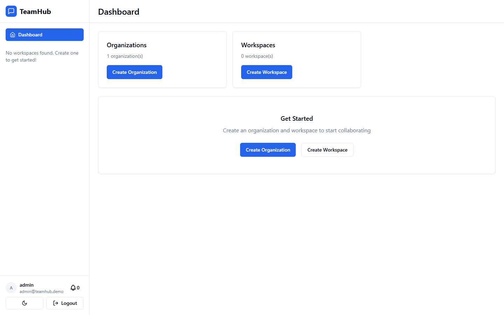
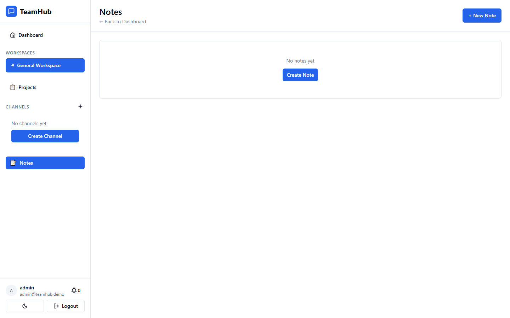
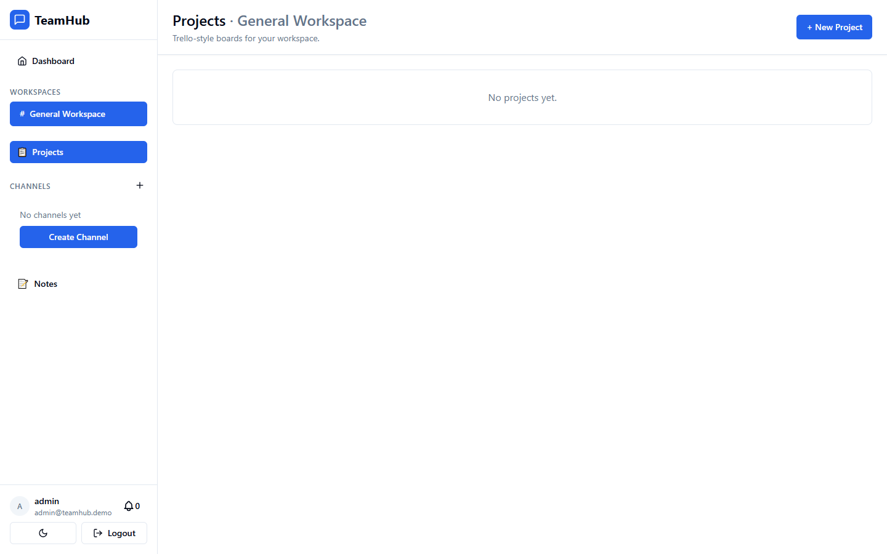

# TeamHub

**Real-time team collaboration platform for messaging, project tracking, collaborative notes, files, notifications, activity, and workspace analytics.**

TeamHub is a full-stack SaaS-style collaboration application inspired by tools such as Linear, Slack, and Notion.

It brings team communication and project coordination into one workspace while demonstrating multi-tenant architecture, role-based access control, real-time systems, background jobs, file handling, analytics, and automated testing.

[](https://react.dev/)
[](https://www.typescriptlang.org/)
[](https://nestjs.com/)
[](https://www.mongodb.com/)
[](https://redis.io/)
[](https://www.docker.com/)

**Repository:** [github.com/shifaosman/TeamHub](https://github.com/shifaosman/TeamHub)

---

## Screenshots

| Dashboard                                               | Notes                                                         |
| ------------------------------------------------------- | ------------------------------------------------------------- |
|  |  |

| Projects                                              | Activity                                                       |
| ----------------------------------------------------- | -------------------------------------------------------------- |
|  |  |

---

## What TeamHub Does

TeamHub gives teams one workspace to communicate, organize work, collaborate on notes, share files, track activity, and understand project progress.

### Real-Time Communication

* Workspace channels
* Real-time messaging
* `@mentions` with autocomplete
* Emoji reactions synchronized through Socket.io
* Threaded replies
* Typing indicators
* Online presence
* Redis-backed Socket.io support for scalable real-time communication

### Multi-Tenant Workspaces

TeamHub supports multiple isolated workspaces with workspace-level permissions.

Available roles:

* Owner
* Admin
* Member
* Guest

Workspace access is enforced across:

* Projects
* Tasks
* Notes
* Messages
* Channels
* Files
* Analytics
* Activity
* Notifications

---

## Project & Task Management

TeamHub includes Kanban-based project and task management.

Features include:

* Kanban boards
* Drag-and-drop task movement using `@dnd-kit`
* Task priorities

  * Low
  * Medium
  * High
  * Urgent
* Labels and tags
* Due dates
* Assignees
* Watchers
* Task comments
* Task detail drawer
* Task descriptions
* Project progress tracking

---

## Collaborative Notes

Team members can create and maintain shared workspace notes.

Features include:

* Collaborative workspace notes
* Version history
* Inline comments
* Workspace-level permissions
* Activity tracking for note changes

---

## File Collaboration

TeamHub includes a centralized workspace file hub:

```text
/workspaces/:workspaceId/files
```

Features include:

* File upload
* Drag-and-drop upload
* Search by file name
* Filter by file type
* Grid view
* List view
* File preview
* File metadata
* File size information
* Uploader information
* Upload date
* File comments
* Download
* Delete
* AWS S3 storage
* Local-storage fallback

The file system is designed to give teams a centralized place for project assets and shared documents.

---

## Smart Command Palette

Press:

```text
Ctrl/Cmd + K
```

to open the TeamHub command palette.

The command palette provides fast keyboard-first navigation and actions.

### Global Search

Search across:

* Channels
* Projects
* Notes
* Tasks
* Messages
* Files

### Quick Commands

Examples:

```text
task Fix authentication bug
```

```text
note Sprint planning
```

```text
analytics
```

```text
activity
```

### Navigation

Navigate quickly to:

* Dashboard
* Activity
* Analytics
* Notes
* Projects

### Keyboard Controls

* `↑` / `↓` — navigate
* `Enter` — select
* `Esc` — close

TeamHub also supports prefix-based command parsing for:

* Creating notes
* Creating tasks
* Navigating to pages
* Opening entities

---

## Notification Center

TeamHub includes a workspace notification center that helps users quickly see what needs their attention.

Notifications support:

* Mentions
* Task assignments
* Task updates
* Note updates
* File comments
* Workspace invitations

The notification UI includes:

* Sidebar notification bell
* Unread notification badge
* Notification list
* Read/unread states
* Relative timestamps
* Related entity information
* Mark one notification as read
* Mark all notifications as read
* Navigation to related tasks, notes, files, or workspaces
* Empty states
* Loading states

Background notification and email processing is handled using BullMQ.

---

## Workspace Activity Timeline

TeamHub records important workspace events automatically.

Tracked activity includes:

* Tasks created
* Tasks moved
* Messages posted
* Files uploaded
* Notes edited
* Channels created
* Workspace members added

The activity page supports filtering by:

* Tasks
* Projects
* Notes
* Messages
* Files
* Channels

Activities are grouped into sections such as:

* Today
* Yesterday
* Earlier this week

The activity system also supports pagination and links back to related workspace entities.

---

## Workspace Analytics

TeamHub includes an analytics dashboard for monitoring team progress and collaboration.

### KPI Metrics

* Total tasks
* Completed tasks
* Projects
* Workspace members

### Task Analytics

* Tasks created over time
* Tasks completed over time
* Task status distribution
* Task priority distribution

### Project Analytics

* Project progress
* Project completion percentages

### Communication Analytics

* Messages over time
* Most active channels

### Team Analytics

* Most active members
* Workspace activity counts

### Collaboration Metrics

* Messages sent
* Notes edited
* Files uploaded

### Date Filters

Analytics can be viewed for:

* 7 days
* 30 days
* 90 days

---

## Technical Highlights

TeamHub was built to demonstrate more than standard CRUD functionality.

The architecture includes workflows and infrastructure commonly required by modern multi-user SaaS applications.

### Multi-Tenant Authorization

Workspace-scoped access with Role-Based Access Control.

### Real-Time Architecture

Socket.io gateway with Redis support for real-time communication.

### Background Processing

BullMQ workers handle asynchronous jobs such as:

* Emails
* Notifications

### Shared Contracts

Reusable TypeScript types and Zod schemas are shared through:

```text
@teamhub/shared
```

### Server State Management

TanStack Query manages API data and caching on the frontend.

### Client State Management

Zustand manages frontend client state.

### File Infrastructure

AWS S3 is supported for file storage with a local-storage fallback.

### API Security

The backend includes:

* JWT authentication
* Refresh-token rotation
* bcrypt password hashing
* Helmet
* Rate limiting
* Request validation
* Role-based authorization

### API Documentation

Swagger/OpenAPI documentation is included.

### Automated Testing

TeamHub includes:

* Frontend component tests
* Backend unit tests
* Backend integration/e2e tests

### CI

GitHub Actions handles:

* Linting
* Testing
* Builds

### Containerized Development

Docker Compose manages development infrastructure such as:

* MongoDB
* Redis

---

## Tech Stack

| Layer                | Technologies                                                                                                                             |
| -------------------- | ---------------------------------------------------------------------------------------------------------------------------------------- |
| **Frontend**         | React 18, TypeScript, Vite, Tailwind CSS, shadcn/ui, Radix UI, Recharts, React Router v6, TanStack Query, Zustand, Zod, Socket.io Client |
| **Backend**          | NestJS 10, Node.js 18+, TypeScript, Mongoose, JWT, Passport.js, Socket.io, BullMQ, Swagger, Nodemailer                                   |
| **Database**         | MongoDB                                                                                                                                  |
| **Realtime / Queue** | Redis, Socket.io, BullMQ                                                                                                                 |
| **File Storage**     | AWS S3 with local-storage fallback                                                                                                       |
| **Infrastructure**   | Docker, Docker Compose, GitHub Actions                                                                                                   |
| **Monorepo**         | npm workspaces, `@teamhub/shared`                                                                                                        |

---

## Architecture

```text
┌─────────────────────────────────────────────────────────────┐
│                    React 18 + Vite                          │
│        TanStack Query · Zustand · Socket.io Client          │
└───────────────────────────┬─────────────────────────────────┘
                            │
                     REST / WebSocket
                            │
                            ▼
┌─────────────────────────────────────────────────────────────┐
│                        NestJS API                           │
│                                                             │
│  Controllers → Services → Mongoose                         │
│                                                             │
│  JWT + RBAC      Socket.io Gateway       BullMQ Workers     │
└───────────────┬──────────────────────┬──────────────────────┘
                │                      │
                ▼                      ▼
        ┌───────────────┐      ┌───────────────┐
        │    MongoDB    │      │     Redis     │
        │  Primary DB   │      │ Pub/Sub/Queue │
        └───────────────┘      └───────────────┘
                │
                ▼
        ┌───────────────────┐
        │ AWS S3 / Local    │
        │ File Storage      │
        └───────────────────┘
```

---

## Request Flow

1. The React frontend sends authenticated REST requests to the NestJS API.
2. Authentication guards and workspace permissions validate access.
3. Services apply business logic.
4. Mongoose persists application data to MongoDB.
5. Socket.io handles real-time events.
6. Redis supports real-time communication and background processing.
7. BullMQ workers handle asynchronous notifications and email jobs.

---

## Analytics Architecture

Analytics are available through:

```http
GET /workspaces/:workspaceId/analytics?period=7d|30d|90d
```

The analytics module uses workspace-scoped MongoDB aggregations to calculate:

* Overview counts
* Task created/completed time series
* Task status distribution
* Task priority distribution
* Project progress
* Most active channels
* Most active users
* Collaboration activity

All analytics queries remain scoped to the current workspace and require appropriate workspace access.

---

## Activity Architecture

Projects, tasks, notes, messages, channels, files, and workspace membership actions can create activity records.

The frontend retrieves these records using a workspace-scoped paginated feed.

Activity records can include:

* Actor
* Event type
* Related entity
* Timestamp
* Workspace
* Navigation target

---

## Project Structure

```text
TeamHub/
├── apps/
│   ├── api/
│   │   └── src/
│   │       ├── auth/
│   │       ├── users/
│   │       ├── workspaces/
│   │       ├── channels/
│   │       ├── messages/
│   │       ├── notes/
│   │       ├── projects/
│   │       ├── tasks/
│   │       ├── files/
│   │       ├── search/
│   │       ├── notifications/
│   │       ├── activity/
│   │       ├── analytics/
│   │       ├── gateway/
│   │       ├── redis/
│   │       └── common/
│   │
│   └── web/
│       └── src/
│           ├── components/
│           ├── pages/
│           ├── hooks/
│           ├── stores/
│           ├── contexts/
│           └── lib/
│
├── packages/
│   └── shared/
│
├── docs/
│   └── screenshots/
│
├── docker-compose.yml
└── package.json
```

---

## Run Locally

### Requirements

* Node.js 18+
* npm 9+
* Docker
* Docker Compose

### Clone the Repository

```bash
git clone https://github.com/shifaosman/TeamHub.git
cd TeamHub
```

### Install Dependencies

```bash
npm install
```

### Configure Environment Variables

Copy the backend environment example:

```bash
cp apps/api/.env.example apps/api/.env
```

The backend configuration includes:

* `NODE_ENV`
* `PORT`
* `MONGODB_URI`
* `REDIS_HOST`
* `REDIS_PORT`
* `JWT_SECRET`
* `JWT_REFRESH_SECRET`
* `JWT_EXPIRES_IN`
* `JWT_REFRESH_EXPIRES_IN`
* `USE_LOCAL_STORAGE`
* `APP_URL`

AWS S3 and SMTP variables are used when those integrations are enabled.

Frontend configuration uses:

* `VITE_API_URL`
* `VITE_WS_URL`

Use `apps/api/.env.example` as the environment configuration reference.

Never commit production credentials or secrets.

---

## Start MongoDB and Redis

```bash
docker-compose up -d mongo redis
```

---

## Seed Demo Data

```bash
npm run seed
```

---

## Start Development Servers

```bash
npm run dev
```

Local services:

| Service     | URL                          |
| ----------- | ---------------------------- |
| Frontend    | `http://localhost:5173`      |
| Backend API | `http://localhost:2000`      |
| Swagger     | `http://localhost:2000/docs` |

---

## Local Demo Accounts

After running the seed command:

| Role   | Email                 | Password     |
| ------ | --------------------- | ------------ |
| Admin  | `admin@teamhub.demo`  | `Admin123!`  |
| Member | `member@teamhub.demo` | `Member123!` |

These accounts are seed accounts intended for local development and testing.

---

## Testing

### Frontend Testing

The frontend uses:

* Vitest
* React Testing Library

Test coverage includes flows such as:

* Login page rendering
* Login form submission
* Authentication errors
* Command palette closed state
* Command palette opening
* Search results
* Page navigation

Run:

```bash
npm run test:web
```

### Backend Testing

The NestJS API uses Jest.

Backend coverage includes:

* Authentication
* Registration
* Login
* Token validation
* Notes
* Analytics
* Files
* Notifications

Run unit tests:

```bash
npm run test:api
```

Run backend e2e tests from `apps/api` with MongoDB available:

```bash
npm run test:e2e
```

---

## API Documentation

When the backend is running locally, Swagger documentation is available at:

```text
http://localhost:2000/docs
```

The backend is organized into workspace-focused modules including:

* Authentication
* Users
* Workspaces
* Channels
* Messages
* Notes
* Projects
* Tasks
* Files
* Search
* Notifications
* Activity
* Analytics

---

## Roadmap

Potential future improvements include:

* Rich-text collaborative editing using TipTap or ProseMirror
* CRDT-based real-time cursors and document collaboration
* Voice and video calls using WebRTC
* React Native mobile application
* Reuse of `@teamhub/shared` across web and mobile clients
* Structured application logging
* OpenTelemetry
* Improved observability dashboards
* Additional integrations
* Webhooks
* GitHub integration
* Jira integration

---

## About the Project

TeamHub is a portfolio project focused on the engineering challenges behind modern collaborative SaaS applications.

It demonstrates practical experience with:

* Full-stack application development
* Multi-tenant architecture
* Authentication
* Authorization
* Role-based access control
* REST APIs
* Real-time systems
* WebSockets
* Redis
* Background queues
* MongoDB data modeling
* File uploads
* Cloud storage
* Notifications
* Analytics
* Automated testing
* Docker
* CI workflows
* Modular backend architecture

The project demonstrates end-to-end ownership across frontend development, backend APIs, database design, authentication and authorization, real-time infrastructure, asynchronous workers, automated testing, and developer tooling.

---

## Author

**Shifa Osman Musa**

Full-Stack Software Engineer

* Portfolio: [shifaosman.com](https://www.shifaosman.com/en)
* GitHub: [github.com/shifaosman](https://github.com/shifaosman)
